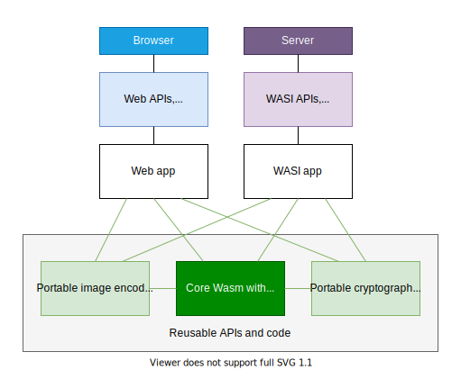

# System Essentials for WebAsssembly

## Introduction

WebAssembly is sandboxed and does not have access to functionality other than what is supported by its instruction set or provided to it via imports. So typically, if there is functionality the host supports but WebAssembly doesn't, one would provide an appropriate import. On the Web, one would import a Web API, while off the Web, one would utilize an import namespace like WASI.

However, some system features like obtaining the current time are essential to run basic (portable) WebAssembly modules both on and off the Web, and being able to access these features in a uniform way would help to battle fragmentation that would otherwise require recompiling to use different import namespaces or, to work around having to recompile, polyfills, which is typically good to avoid on the Web where code size is especially important.

This document explores a new set of essential `system.*` instructions.

## Motivation

Code reuse on and off the Web is desirable for the long-term success of the broader WebAssembly ecosystem, even though different environments may impose different requirements on system APIs. Some system APIs are common among the Web and Non-Web, however, so providing these in a portable way makes individual components reusable across ecosystems, e.g. without having to recompile and link statically or having to utilize a polyfill.

  

## Instructions

* `system.time_local` obtains the current local time in milliseconds since Unix epoch.
  * `system.time_local : [] -> [i64]`

* `system.time_utc` obtains the current universal time in milliseconds since Unix epoch.
  * `system.time_utc : [] -> [i64]`

* `system.timezoneoffset` obtains the timezone offset between local and universal time in minutes.
  * `system.timezoneoffset : [] -> [i32]`

* `system.hrtime` obtains the system's monotonic high resolution time in nanoseconds since an arbitrary time in the past.
  * `system.hrtime : [] -> [i64]`

* `system.random` obtains cryptographically secure random bytes and stores them to memory.
  * `system.random : [i32, i32] -> []`

## Potential extensions

The following extensions are not feasible yet because they depend on future features such as Interface Types or may require further evaluation, but may become useful eventually:

* `system.log` logs a message to the system console.
  * `system.log : [string] -> []`

* Access to the system's IANA timezone database.

## Considerations

The list of instructions is not exhaustive and does not imply that instructions not yet mentioned aren't desirable. However, all `system.*` instructions must be safe, as in not negatively affecting the host, other applications or their data.

## Use cases

* WASI applications could utilize system essentials, once available, reducing non-portable WASI API surface.
* AssemblyScript could replace its custom essentials `env.time`, `env.seed` and eventually `env.trace` and `env.abort` (requires `system.log`) currently implemented as imports with system essentials, and would not have to choose between Web APIs (incompatible with WASI) and WASI (polyfill required).
* Programs or libraries not specifically requiring Web or WASI APIs would not need additional non-portable imports in general.
